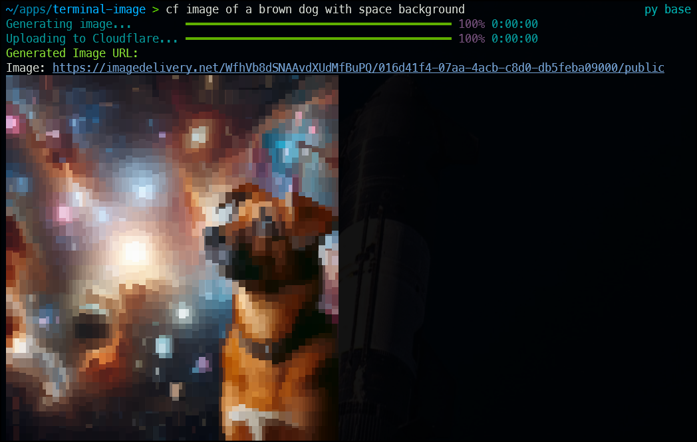

# Cloudflare Terminal Image Generator (`cf`)

This Python script provides a quick and easy way to generate images using OpenAI's API, upload them to Cloudflare Images, and get back hosted URLs directly in your terminal. Simply type a description (e.g., `python cf.py image of a brown dog with space background`), and the script will generate one image, upload to Cloudflare, and display clickable URLs—all with a professional, progress-tracked interface powered by the `rich` library.

Perfect for developers, designers, or anyone needing fast image generation and hosting without the hassle of saving files locally. Cloudflare Images serves the uploaded image in any size or format as needed, making them versatile for projects.

---

## Features

- **Cross-Platform**: Works on Windows and Linux.
- **Image Generation**: Creates one images per request using Dalle-3 in 1024x1024.
- **Secure**: Stores API keys in environment variables, not the script.
- **Professional Output**: Uses `rich` for progress bars and formatted terminal display.
- **In-Memory Processing**: No temporary files saved to disk.
- **Simple Usage**: Run with a single command and your image description.

---

## Example 




## Prerequisites

Before using the script, ensure you have:
- **Python 3.x** installed ([Download Python](https://www.python.org/downloads/)).
- A terminal (e.g., Command Prompt or PowerShell on Windows, Bash or Zsh on Linux).
- API keys from OpenAI and Cloudflare (see below).

---

## Setup Instructions

Follow these steps to set up and run the script:

### Step 1: Clone the Repository

Clone this repository to your local machine:

```bash
git clone https://github.com/bigsk1/terminal-image.git
cd terminal-image
pip install requests rich pillow
```

```bash
sudo apt install viu chafa -y
```

Step 3: Obtain API Keys
OpenAI API Key

  Go to the OpenAI Platform.
  Sign up or log in.
  Navigate to the API section and create a new API key.
  Copy the key (e.g., sk-...)—you’ll need it in Step 4.

Cloudflare API Token and Account ID

  Log in to your Cloudflare Dashboard.
  Go to Images > API Tokens (ensure you have Cloudflare Images enabled in your account).
  
  Create a new API token with the Cloudflare Images: Edit permission.
  
  Copy the token (e.g., Bearer ...).
  
  From the Cloudflare Dashboard, note your Account ID (found under Account Home or in the URL: https://dash.cloudflare.com/<ACCOUNT_ID>).

Step 4: Set Environment Variables

Store your API keys securely as environment variables.
On Linux

  Open your shell configuration file (e.g., ~/.zshrc or ~/.bashrc):
  
  ```bash
  sudo nano ~/.zshrc
  ```
    
Add these lines, replacing the placeholders with your keys:

  ```bash
  export OPENAI_API_KEY="your-openai-key"
  export CLOUDFLARE_API_TOKEN="your-cloudflare-token"
  export CLOUDFLARE_ACCOUNT_ID="your-account-id"
  ```
    
Save and apply the changes:

  ```bash
  source ~/.zshrc
  ```

On Windows

Open Command Prompt or PowerShell as Administrator.
Set the variables permanently:

  ```bash
  setx OPENAI_API_KEY "your-openai-key"
  setx CLOUDFLARE_API_TOKEN "your-cloudflare-token"
  setx CLOUDFLARE_ACCOUNT_ID "your-account-id"
  ```
    
Close and reopen your terminal to apply the changes.

    
### The Script (cf.py)


  ```py
  #!/usr/bin/env python3

import os
import sys
import requests
import base64
from rich.console import Console
from rich.progress import Progress
from io import BytesIO

# Initialize Rich console for pretty terminal output
console = Console()

# Retrieve API keys from environment variables
openai_api_key = os.environ.get("OPENAI_API_KEY")
cloudflare_api_token = os.environ.get("CLOUDFLARE_API_TOKEN")
cloudflare_account_id = os.environ.get("CLOUDFLARE_ACCOUNT_ID")

# Check if API keys are set
if not all([openai_api_key, cloudflare_api_token, cloudflare_account_id]):
    console.print(
        "[bold red]Error: Missing API keys or account ID. Please set OPENAI_API_KEY, "
        "CLOUDFLARE_API_TOKEN, and CLOUDFLARE_ACCOUNT_ID in your environment.[/bold red]"
    )
    sys.exit(1)

# Parse the image description from command-line arguments
if len(sys.argv) < 2:
    console.print("[bold red]Usage: python cf.py <image description>[/bold red]")
    sys.exit(1)

description = " ".join(sys.argv[1:])

# Main script logic
try:
    with Progress() as progress:
        # Step 1: Generate image with OpenAI (DALL-E 3)
        task1 = progress.add_task("[cyan]Generating image...", total=1)
        openai_headers = {
            "Authorization": f"Bearer {openai_api_key}",
            "Content-Type": "application/json",
        }
        openai_data = {
            "prompt": description,
            "n": 1,  # DALL-E 3 only supports 1 image
            "size": "1024x1024",
            "response_format": "b64_json",
            "model": "dall-e-3",
        }
        response = requests.post(
            "https://api.openai.com/v1/images/generations",
            headers=openai_headers,
            json=openai_data,
        )
        response.raise_for_status()
        image_b64 = response.json()["data"][0]["b64_json"]
        progress.update(task1, advance=1)

        # Step 2: Decode base64 to bytes
        image_data = base64.b64decode(image_b64)

        # Step 3: Upload image to Cloudflare
        task2 = progress.add_task("[cyan]Uploading to Cloudflare...", total=1)
        cloudflare_headers = {"Authorization": f"Bearer {cloudflare_api_token}"}
        file_like = BytesIO(image_data)
        files = {"file": ("image.png", file_like, "image/png")}
        response = requests.post(
            f"https://api.cloudflare.com/client/v4/accounts/{cloudflare_account_id}/images/v1",
            headers=cloudflare_headers,
            files=files,
        )
        response.raise_for_status()
        image_url = response.json()["result"]["variants"][0]
        progress.update(task2, advance=1)

    # Step 4: Display the URL
    console.print("[bold green]Generated Image URL:[/bold green]")
    console.print(f"Image: {image_url}")

except requests.exceptions.RequestException as e:
    # Enhanced error reporting
    console.print(f"[bold red]Network Error: {e}[/bold red]")
    if hasattr(e.response, 'text'):
        console.print(f"[red]Error Details: {e.response.text}[/red]")
except Exception as e:
    console.print(f"[bold red]Unexpected Error: {e}[/bold red]")
    sys.exit(1)
  ```

Usage

Navigate to the repository folder in your terminal:

  ```bash
  cd terminal-image
  ```
    
Run the script with your image description:

  ```bash
  python cf.py image of a brown dog with space background
  ```
    
Optional: Alias as cf

To run the script as cf <description> instead of python cf.py <description> from your terminal anywere!
On Linux

  Move the script to a directory in your PATH:
  
  ```bash
  sudo mv cf.py /usr/local/bin/cf
  sudo chmod +x /usr/local/bin/cf
  ```
  
  Run it anywere with:
  
  ```bash
  cf image of a brown dog with space background
  ```
    
On Windows

  Add the script’s directory to your system PATH.
  Create a cf.bat file in a PATH directory:

  ```bash
  @echo off
  python "path\to\cf.py" %*
  ```
    
Run it:

  ```bash
  cf image of a brown dog with space background
  ```


Troubleshooting

  API Key Errors: Verify the environment variables are set:
  
      Linux: echo $OPENAI_API_KEY
      Windows: echo %OPENAI_API_KEY%
      
  Network Issues: Check your internet connection if you see "Network Error".
  
  URLs Not Clickable: Some terminals don’t support hyperlinks—copy and paste the URLs instead.
  
  Permission Denied (Linux): Ensure the script is executable (chmod +x cf.py).


    
