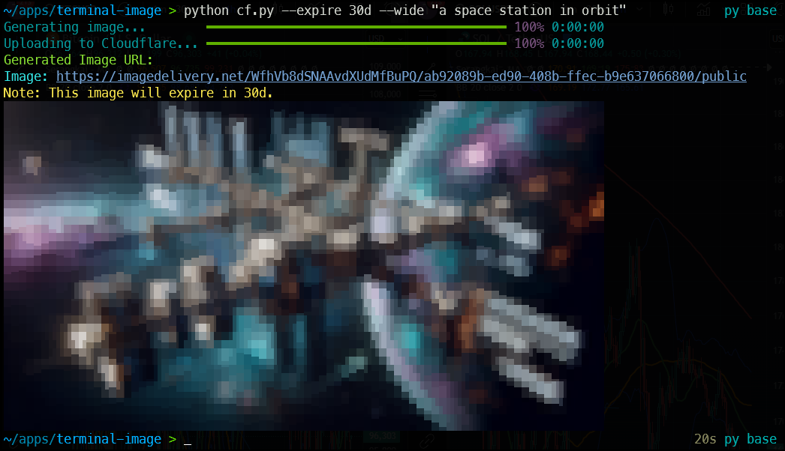

# Cloudflare Terminal Image Generator (`cf`)

This Python script provides a quick and easy way to generate images using OpenAI's API, upload them to Cloudflare Images, and get back hosted URLs directly in your terminal. Simply type a description (e.g., `python cf.py "image of a brown dog with space background"`), and the script will generate an image, upload it to Cloudflare, and display clickable URLs—all with a professional, progress-tracked interface powered by the `rich` library.

Perfect for developers, designers, or anyone needing fast image generation and hosting without the hassle of saving files locally. Cloudflare Images serves the uploaded image in any size or format as needed, making them versatile for projects.

---

## Features

- **Cross-Platform**: Works on Windows, macOS, and Linux.
- **Image Generation**: Creates one image per request using DALL-E 3 in either 1024x1024 or 1792x1024.
- **Secure**: Stores API keys in environment variables, not the script.
- **Professional Output**: Uses `rich` for progress bars and formatted terminal display.
- **Image Preview**: Provides a low-resolution preview of your image in the terminal.
- **History Logging**: Stores generated images with timestamps and expiration status.
- **Simple Usage**: Run with a single command and your image description.

---

## Example


---

## Prerequisites

Before using the script, ensure you have:
- **Python 3.x** installed ([Download Python](https://www.python.org/downloads/)).
- A terminal (e.g., Command Prompt, PowerShell, Bash, or Zsh).
- API keys from OpenAI and Cloudflare (see below).

---

## Setup Instructions

### Step 1: Clone the Repository

```bash
git clone https://github.com/bigsk1/terminal-image.git
cd terminal-image
pip install requests rich pillow
```

Install optional image preview tools:
```bash
sudo apt install viu chafa -y  # Linux
```

---

### Step 2: Obtain API Keys

#### OpenAI API Key
- Go to the [OpenAI Platform](https://platform.openai.com/).
- Sign up or log in.
- Navigate to the API section and create a new API key.
- Copy the key (e.g., `sk-...`).

#### Cloudflare API Token and Account ID
- Log in to your [Cloudflare Dashboard](https://dash.cloudflare.com/).
- Navigate to **Images > API Tokens** (ensure Cloudflare Images is enabled).
- Create a new API token with the **Cloudflare Images: Edit** permission.
- Copy the token (`Bearer ...`).
- Note your **Account ID** (found under Account Home or in the URL `https://dash.cloudflare.com/<ACCOUNT_ID>`).

---

### Step 3: Set Environment Variables

#### On Linux/macOS
Open your shell configuration file (e.g., `~/.zshrc` or `~/.bashrc`):
```bash
sudo nano ~/.zshrc
```

Add these lines:
```bash
export OPENAI_API_KEY="your-openai-key"
export CLOUDFLARE_API_TOKEN="your-cloudflare-token"
export CLOUDFLARE_ACCOUNT_ID="your-account-id"
```

Save and apply changes:
```bash
source ~/.zshrc
```

#### On Windows
Open Command Prompt or PowerShell as Administrator and set the variables:
```powershell
setx OPENAI_API_KEY "your-openai-key"
setx CLOUDFLARE_API_TOKEN "your-cloudflare-token"
setx CLOUDFLARE_ACCOUNT_ID "your-account-id"
```

Close and reopen your terminal.

---

## Usage

Navigate to the repository folder:
```bash
cd terminal-image
```

Run the script with your image description:
```bash
python cf.py "image of a brown dog with space background"
```

### Additional Options
| Option | Description |
|--------|-------------|
| `--wide` | Generate a **wide** image (1792x1024). |
| `--expire 24h` | Set image to **auto-expire** after **24 hours**. |
| `--expire 30d` | Set image to **auto-expire** after **30 days**. |
| `--history` | View past image generations (URLs, prompts, and expiry status). |
| `--help` | Show available options. |




### Example Commands:
```bash
python cf.py --wide "futuristic cyberpunk city"
python cf.py --expire 24h "a robot in the rain"
python cf.py --expire 30d --wide "a space station in orbit"
python cf.py --history  # View previously generated images
```

---

### Optional: Alias `cf` for Easier Usage

#### On Linux/macOS
Move the script to a directory in your PATH:
```bash
sudo mv cf.py /usr/local/bin/cf
sudo chmod +x /usr/local/bin/cf
```
Now, run it anywhere:
```bash
cf "image of a brown dog with space background"
```

#### On Windows
Create a batch file in a PATH directory:
```bash
echo @echo off > C:\Windows\cf.bat
echo python "C:\path\to\cf.py" %%* >> C:\Windows\cf.bat
```
Run it:
```bash
cf "image of a brown dog with space background"
```

---

### Troubleshooting

- **API Key Errors:** Verify the environment variables are set:
  - Linux/macOS: `echo $OPENAI_API_KEY`
  - Windows: `echo %OPENAI_API_KEY%`
- **Network Issues:** Check your internet connection if you see "Network Error."
- **URLs Not Clickable:** Some terminals don’t support hyperlinks—copy and paste the URLs instead.
- **Permission Denied (Linux/macOS):** Ensure the script is executable (`chmod +x cf.py`).

---

### Example Generated Image


